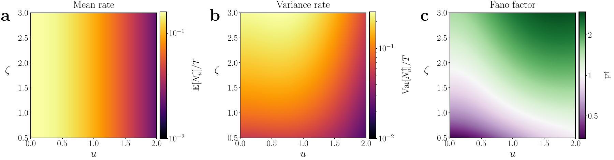

# Gaussian Crossings

**From a Gaussian process's covariance to the variability of its level crossings.**

[](pyproject.toml)
[](LICENSE)
[](https://arxiv.org/abs/2605.25278)

Code accompanying **[Exact Variance and Fano Factor for Arbitrary Level Crossings in Stationary Gaussian Processes](https://arxiv.org/abs/2605.25278)**, by Shivang Rawat, Flaviano Morone, David J. Heeger, and Stefano Martiniani.



*Figure 2: the mean rate is independent of damping, while the variance and Fano factor reveal changes in temporal organization. White in the Fano panel marks one.*

[Quick start](#quick-start) · [The mathematics](#the-mathematics) · [Reproduce the paper](#reproduce-the-paper) · [API and numerical notes](docs/api.md) · [Tests](#development-and-tests)

## What the package does

Given an autocovariance $r(t)$ and a threshold $u$, compute the mean, finite-window variance, and long-time Fano factor of **upcrossings, downcrossings, or all crossings** of a smooth stationary Gaussian process. The package also supplies covariance functions, Gaussian-path samplers, crossing counters, and differentiable special functions.

A crossing rate describes **how often** events occur. The variance describes **how variable the event count is** across observation windows. Two processes can have the same rate and very different count variability because their correlations differ away from zero lag.

| Quantity | Meaning | Main methods |
|---|---|---|
| Mean count | Expected events in a window of length $T$ | `upcrossing_mean(T)`, `crossing_mean(T)` |
| Finite-window variance | Count variability at the specified $T$ | `upcrossing_variance(T)`, `crossing_variance(T)` |
| Finite-window Fano ratio | Variance divided by mean at that $T$ | `upcrossing_fano_factor(T)` |
| Long-time Fano factor | Limiting variance-to-mean ratio | `upcrossing_fano_factor_CLT()` |

Replace `upcrossing` with `downcrossing` for the corresponding downward-crossing methods. Upward and downward statistics agree for the stationary Gaussian processes considered here. Total-crossing variance is **not** obtained by simply doubling upcrossing variance.

## Installation

Requires Python 3.10 or newer. From a clone:

```bash
git clone https://github.com/shivangrawat/gaussian-crossings.git
cd gaussian-crossings
uv sync --all-extras --locked
```

Or use pip in a virtual environment:

```bash
python -m pip install -e '.[dev,notebooks,reproduce]'
```

Core dependencies are NumPy, SciPy, PyTorch, and Matplotlib. Notebook and development tools are optional extras. The figure runner uses `mpmath` for high-precision checks; rendering the paper's typography also requires a LaTeX installation. The optional manuscript-comparison command additionally needs `latexmk`.

## Quick start

### Crossing statistics

```python
from gaussian_crossings import GaussianUpCrossings
from gaussian_crossings.process import r_damped_harmonic_oscillator_noise

model = GaussianUpCrossings(
    r_damped_harmonic_oscillator_noise,
    u=0.5,
    temp=1.0,
    omega0=1.0,
    zeta=0.5,
)

T = 120.0
mean = model.upcrossing_mean(T)
variance = model.upcrossing_variance(T)
fano_T = model.upcrossing_fano_factor(T)
fano_infinity = model.upcrossing_fano_factor_CLT()

print(f"Mean: {mean.item():.6f}")
print(f"Variance: {variance.item():.6f}")
print(f"Finite-window ratio: {fano_T.item():.6f}")
print(f"Long-time Fano factor: {fano_infinity.item():.6f}")
```

These methods evaluate the analytical formulas using a fixed integration grid. Increase `num_points` and vary the endpoint cutoffs to assess convergence. For the paper's reported values and figures, use the separately validated [reproduction workflow](#reproduce-the-paper), which controls small-lag cancellation and long-time tails.

### Simulate and count events

```python
import torch
from gaussian_crossings.process import r_squared_exp
from gaussian_crossings.utils import (
    simulate_gaussian_process_fft,
    count_upcrossings,
    upcrossing_times,
)

torch.manual_seed(27)
t, x = simulate_gaussian_process_fft(
    r_squared_exp, T=100.0, dt=0.01, sigma=1.0, tau=1.0,
)
print("Upcrossings:", count_upcrossings(x, threshold=0.5))
event_times = upcrossing_times(x, t, threshold=0.5)
```

Sampling can miss crossings between time points. Refine `dt` before comparing sampled counts with continuous-time predictions. The FFT sampler checks its circulant covariance embedding; it raises an error if the embedding is not positive semidefinite. Cholesky sampling is available for smaller problems.

## The mathematics

For a zero-mean stationary Gaussian process with variance $r(0)$ and derivative variance $-r''(0)$, the Kac-Rice mean upcrossing rate is

$$
\nu_u = \frac{1}{2\pi}\sqrt{\frac{-r''(0)}{r(0)}}
\exp\!\left(-\frac{u^2}{2r(0)}\right),
\qquad \mathbb{E}[N_u^\uparrow(T)] = T\nu_u.
$$

Only the covariance's value and curvature at zero enter the mean. The paper reduces the **variance** to a single time integral whose integrand depends on the full covariance and its first two derivatives:

$$
\operatorname{Var}[N_u^\uparrow(T)]
= T\nu_u + 2\int_0^T (T-t)\,I_u^\uparrow(t)\,dt.
$$

Here $I_u^\uparrow(t)$ is the joint crossing intensity minus $\nu_u^2$. Its closed-form expression uses the error function and Owen's $T$ function. When the excess pair intensity is integrable,

$$
F_u^\uparrow = 1 + \frac{2}{\nu_u}\int_0^\infty I_u^\uparrow(t)\,dt.
$$

- **$F<1$:** underdispersion relative to Poisson counts.
- **$F>1$:** overdispersion relative to Poisson counts.
- **$F=1$:** equality of variance and mean; this alone does not establish a Poisson process.

Upward and downward crossings alternate. When the upcrossing variance grows at most linearly with time, the total-crossing long-time Fano factor satisfies $F=2F^\uparrow$. Thus the high-level Poisson limit for **upcrossings** gives a total-crossing limit of two.

The theory assumes a nondegenerate stationary Gaussian process with sufficiently smooth sample paths and covariance. The long-time limit needs additional integrability conditions. Ordinary, unfiltered OU paths are not smooth enough for these crossing formulas, although their covariance remains useful for simulation.

### What the examples reveal

**Damped harmonic oscillator.** The mean rate is independent of damping at fixed temperature and natural frequency. Low-threshold underdamped crossings can be underdispersed, while higher thresholds can produce $F>1$ even in the underdamped regime. Both damping and threshold matter.

**Mean reversion driven by OU noise.** Purely relaxational correlations also produce nonmonotonic Fano factors. The revised Figure 5 shows a sub-to-super-Poissonian transition; it does not resolve a return below one over its plotted range.

**Rational-quadratic covariance.** All five curves in Figure 6, including the squared-exponential limit, have a maximum above one. The overshoot becomes small as the kernel approaches the squared-exponential limit. The high-threshold approach to one is subject to the paper's dependence assumptions.

## Reproduce the paper

Start with [`examples/PRE_regenerated_figures.ipynb`](examples/PRE_regenerated_figures.ipynb), or run the commands below. It uses [`examples/pre_figures.py`](examples/pre_figures.py) for the numerical figures (Figures 2–6), and also exports alternative illustrations for Figure 1 and Supplemental Figure S1. The submitted revision retains the original illustrations.

The runner uses stable conditional covariances, adaptive quadrature, explicit tail checks, and independent positive Gaussian integrals. It preserves the signed error-function argument. It checks the package's integrands against those independent calculations.

### Published revision data

The tagged release [`pre-revision-2026-09-27`](https://github.com/shivangrawat/gaussian-crossings/tree/pre-revision-2026-09-27) contains a
[checksum-verified archive](reproduction/README.md) of the arrays and crossing counts used in Figures 2–6. To reproduce those figures without rerunning the simulation:

```bash
uv run python examples/restore_pre_archive.py
uv run python examples/pre_figures.py plot \
  --output data/pre_figures_20260927 --figures figures/publication
```

For a new calculation instead, follow the steps below.

### 1. Generate the Figure 3 simulation archive

To create a new ensemble, use a fresh output directory. The following commands use `data/pre_figure3_10000`; do not run them over a restored manuscript archive. Generate 10,000 trials at each damping ratio, then analyze them:

```bash
uv run python examples/damped_harmonic_oscillator/pre_figure3.py validate
uv run python examples/damped_harmonic_oscillator/pre_figure3.py simulate \
  --output data/pre_figure3_10000 --trials 10000 --dt 0.00125 \
  --seed 20260927 --workers 3
uv run python examples/damped_harmonic_oscillator/pre_figure3.py analyze \
  --output data/pre_figure3_10000 --bootstrap 10000
```

This is the full simulation, not a smoke test. It uses stationary initial conditions, exact Gaussian transitions, nested sampling grids, and whole-trial bootstrap resampling. The 95% intervals are pointwise. Numerical convergence checks do not require every individual interval to contain the theoretical value.

If you already have the manuscript's validated archive, preserve it. The source that generated an existing ensemble is recorded in `run.json`; use its archived `run_source.py` for reanalysis when the current source hash differs. The current plotting command can render its existing summary. See [the reproduction guide](docs/reproducibility.md) for the distinction between the archived manuscript ensemble and a new run.

### 2. Calculate and export all figures

Choose a fresh output directory:

```bash
uv run python examples/pre_figures.py all \
  --output data/pre_figures_new --figures figures/publication
```

To re-export an existing numerical archive:

```bash
uv run python examples/pre_figures.py plot \
  --output data/pre_figures_20260927 --figures figures/publication
```

Both commands stay within this repository. Existing calculation archives are protected against overwriting. Figures are PDFs; LaTeX caches and auxiliary files go under `build/` directories.

| Paper figure | Subject | Retained source notebook |
|---|---|---|
| 1 | Crossing events on example paths | [`fig1_illustration`](examples/fig1_illustration.ipynb) |
| 2 | SDHO mean, variance, and Fano landscape | [`sdho_zeta`](examples/damped_harmonic_oscillator/sdho_zeta.ipynb) |
| 3 | Finite-window theory and simulation | [`theory_simulation_upcrossings`](examples/damped_harmonic_oscillator/theory_simulation_upcrossings.ipynb) |
| 4a-c | Frequency and threshold scan | [`fano_scan_omega0`](examples/damped_harmonic_oscillator/fano_scan_omega0.ipynb) |
| 4d-f | Temperature and threshold scan | [`fano_scan_temp`](examples/damped_harmonic_oscillator/fano_scan_temp.ipynb) |
| 5 | OU-driven mean reversion | [`OU_noise`](examples/OU_noise/OU_noise.ipynb) |
| 6 | Rational-quadratic and squared-exponential limits | [`rational_quadratic`](examples/rational_quadratic/rational_quadratic.ipynb) |
| S1 | Integration-region geometry | Reconstructed by `pre_figures.py` |

These seven source notebooks retain the exploratory figure calculations and parameter choices. The PRE runner is the reproduction path for the revised paper, including Figure 3's updated simulation and error bars. Unrelated exploratory and estimation notebooks have been removed.

## Repository guide

```text
gaussian_crossings/
  formula/         Shared analytical engine and compatibility interfaces
  process/         Covariance functions and stochastic dynamical systems
  utils/           Simulators, crossing detection, differentiable Owen's T
examples/          Figure notebooks and the validated PRE runners
tests/             Regression, analytical, simulation, and paper-reference tests
docs/              API notes, numerical caveats, and reproduction details
data/              Generated numerical archives (not versioned)
figures/           Generated exports (not versioned)
```

## Development and tests

```bash
uv sync --all-extras --locked
uv run pytest
uv run ruff check gaussian_crossings tests
uv run ruff format --check gaussian_crossings tests
```

Tests cover 60 numerical compatibility cases, independent conditional-Gaussian integrals, sign symmetry, dimensional scaling, analytical gradients, covariance identities, sampling statistics, crossing endpoint rules, and the paper's numerical benchmarks. The full local-archive check runs when the Figure 3 archive is present; otherwise it is reported as skipped. All other tests work from a fresh clone.

Existing class names and import paths remain supported. Importing the package leaves PyTorch's global default dtype unchanged; formula evaluation uses explicit double precision. The older `GaussianUpCrossingsDimless_minimal` class retains its historical quadrature for compatibility and is not the recommended interface for new work. See [API and numerical notes](docs/api.md).

## Citation and license

```bibtex
@misc{rawat2026exact,
  title={Exact Variance and Fano Factor for Arbitrary Level Crossings in Stationary Gaussian Processes},
  author={Rawat, Shivang and Morone, Flaviano and Heeger, David J. and Martiniani, Stefano},
  year={2026},
  eprint={2605.25278},
  archivePrefix={arXiv},
  primaryClass={math.PR},
  doi={10.48550/arXiv.2605.25278}
}
```

Machine-readable citation metadata is in [`CITATION.cff`](CITATION.cff). Code is released under the [MIT license](LICENSE).
